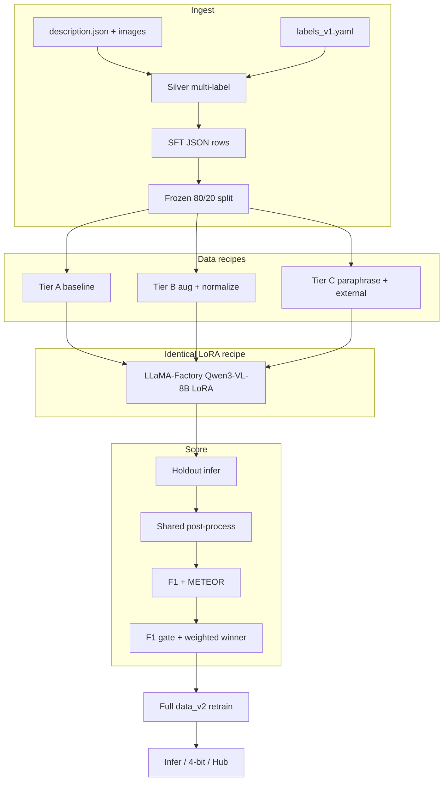

# Technical Report: Structural Damage Image–Text VLM Diagnosis

**Project:** Offline fine-tuning of Qwen3-VL-8B-Instruct for multi-label structural damage classification and technical description generation  
**Repository companion:** See [README.md](README.md) for step-by-step commands.  
**Official hidden-test report:** [OFFICIAL_TEST_REPORT.md](OFFICIAL_TEST_REPORT.md)  
**Published LoRA:** [nhantran214/damage-vlm-qwen3vl-8b-lora](https://huggingface.co/nhantran214/damage-vlm-qwen3vl-8b-lora)

---

## Table of Contents

1. [Executive Summary](#1-executive-summary)
2. [Problem Statement](#2-problem-statement)
3. [Goals and Design Principles](#3-goals-and-design-principles)
4. [System Overview](#4-system-overview)
5. [Data and Closed Label Set](#5-data-and-closed-label-set)
6. [Silver Labeling](#6-silver-labeling)
7. [Train / Validation Split](#7-train--validation-split)
8. [Supervised Fine-Tuning Format and Prompts](#8-supervised-fine-tuning-format-and-prompts)
9. [Three-Tier Data Bake-Off](#9-three-tier-data-bake-off)
10. [Model and Training Recipe](#10-model-and-training-recipe)
11. [Inference Pipeline](#11-inference-pipeline)
12. [Post-Processing Stack](#12-post-processing-stack)
13. [Evaluation Metrics](#13-evaluation-metrics)
14. [Winner Selection](#14-winner-selection)
15. [Full Retrain on Updated Corpus](#15-full-retrain-on-updated-corpus)
16. [Low-VRAM Deployment and Hub Packaging](#16-low-vram-deployment-and-hub-packaging)
17. [Experimental Results](#17-experimental-results)
18. [Software Architecture](#18-software-architecture)
19. [Reproducibility Notes](#19-reproducibility-notes)
20. [Limitations and Future Work](#20-limitations-and-future-work)
21. [Glossary](#21-glossary)
22. [Official Hidden-Test Protocol](#22-official-hidden-test-protocol)

---

## 1. Executive Summary

This project builds an **offline** vision–language model (VLM) pipeline that, given a photo of a civil structure, produces a single JSON object:

```json
{
  "image_id": "00002",
  "damage_categories": ["cracks", "spalling"],
  "description": "Detailed technical English description of morphology, orientation, severity, or size."
}
```

The backbone is **Qwen3-VL-8B-Instruct**, adapted with **LoRA** through **LLaMA-Factory**. Competition-style scoring uses:

- **Multi-label F1** over a fixed 10-class closed set (category quality)
- **METEOR** on the free-text description (linguistic / content overlap)
- A **winner rule**: keep only tiers within 3% of the best F1, then maximize `0.6 × F1 + 0.4 × METEOR`

Three **data recipes** (Tier A / B / C) were compared on the **same** model and training hyperparameters. **Tier A** (clean baseline SFT, no augmentation) won on the frozen holdout. The winning recipe was then retrained on the full updated corpus (`data_v2`, ~1,200 images). The resulting LoRA is published on Hugging Face and can be used in full-precision or with 4-bit base-model loading for low-VRAM machines.

**Holdout bake-off (n = 237 validation images):**

| Tier | F1 | METEOR | Weighted (0.6 F1 + 0.4 METEOR) |
|------|-----|--------|--------------------------------|
| **A (winner)** | **0.953** | 0.638 | **0.827** |
| B | 0.950 | **0.643** | 0.827 |
| C | 0.938 | 0.614 | 0.808 |

---

## 2. Problem Statement

### 2.1 Why this task is hard

Structural damage assessment is inherently **multi-aspect**:

1. **Multi-label categories** — One image often shows several damage types at once (e.g. spalling + exposed rebar + corrosion). Prefix-only filenames miss this; analysis of long descriptions showed a large fraction mention two or more damage keywords.
2. **Fine-grained language** — Inspectors care about orientation (“vertical crack”), severity, and morphology, not only class names. That motivates a VLM that emits both labels and a technical paragraph.
3. **Small, noisy corpus** — Roughly **1,200 images** with VQA-style records (`img`, `prompt`, `label`), not already in the submission JSON schema. Descriptions vary in style and completeness.
4. **Offline constraint** — Training and inference must not depend on cloud LLM APIs in the main path.
5. **Single-GPU VRAM budget** — Target hardware is an **NVIDIA RTX 5880 Ada (~49 GB)**. Full fine-tuning of an 8B VLM without care can OOM; the recipe freezes the vision tower and uses LoRA on the language-side projections.

### 2.2 Competition-shaped output contract

The system must emit **one valid JSON object per image**, with:

| Field | Type | Meaning |
|-------|------|---------|
| `image_id` | string | Filename stem (no extension) |
| `damage_categories` | list of strings | Subset of the closed 10-label set |
| `description` | string | Technical English description |

No markdown fences, chat filler, or extra keys are desired at scoring time. A shared **post-processing** stack repairs and aligns outputs before metrics and submission.

---

## 3. Goals and Design Principles

| Principle | Rationale |
|-----------|-----------|
| **One backbone, many data recipes** | Isolate the effect of data quality/augmentation; avoid confounding model architecture changes. |
| **Config-as-data for labels** | Closed set, synonyms, prefix seeds, and alignment templates live in `configs/labels_v1.yaml`. |
| **Frozen holdout** | One stratified multi-label split reused for all tiers; no mid-experiment reshuffle. |
| **No validation leakage** | Paraphrases / external mixes must never include val image IDs. |
| **Identical post-process for every score** | Fair tier comparison and submission consistency. |
| **VRAM-safe defaults** | Prefer freezing vision + LoRA + capped pixels over chasing larger models. |
| **Offline-first** | Local weights and scripts; Hub upload is optional packaging. |

---

## 4. System Overview

End-to-end flow:

```text
Raw corpus (description.json + image/)
        │
        ▼
 Parse + resolve paths
        │
        ▼
 Silver multi-label categories  ←── labels_v1.yaml (closed set, synonyms, prefixes)
        │
        ▼
 SFT JSON conversations (ShareGPT-style + images)
        │
        ▼
 Frozen 80/20 multi-label split  →  Tier A / B / C train sets
        │
        ▼
 LLaMA-Factory LoRA SFT (same recipe per tier)
        │
        ▼
 Holdout inference → post-process → F1 + METEOR
        │
        ▼
 Winner selection (F1 gate + weighted score)
        │
        ▼
 Full retrain on data_v2 with winning recipe
        │
        ▼
 Submission inference / eval / optional Hub push
```

**High-level components:**

| Layer | Responsibility |
|-------|----------------|
| `scripts/` | Numbered CLI entrypoints (build → train → infer → eval → export → Hub) |
| `src/damage_vlm/` | Testable library: data, metrics, post-process, infer, winner |
| `configs/` | Labels, prompts, eval weights, LLaMA-Factory YAMLs |
| `data/` / `data_v2/` | Raw and processed datasets |
| `outputs/` | Adapters, predictions, eval reports, submissions, exports |

---

## 5. Data and Closed Label Set

### 5.1 Corpus layout

Typical dataset root (`data/dataset` for bake-off, `data_v2/dataset` for full retrain):

```text
dataset/
  description.json   # VQA-style records (robust parser; not always a strict JSON array)
  image/             # JPG/PNG (and alternate extensions via path resolver)
```

Each logical image may appear with multiple VQA rows. The pipeline **groups by image** and takes the **longest `label`** as the characteristic description for silver labeling and SFT targets.

### 5.2 Closed label set (V1)

Exactly ten classes (order is fixed for indicator matrices and reporting):

1. `spalling`
2. `cracks`
3. `corrosion`
4. `voids`
5. `exposed_rebar`
6. `peeling`
7. `potholes`
8. `honeycomb`
9. `looseness`
10. `efflorescence`

These are defined in `configs/labels_v1.yaml` together with:

- **Prefix seeds** — Letter prefixes in filenames (e.g. `crack_*` → `cracks`; `gangf_*` → `exposed_rebar` + `cracks`). Numeric / no-prefix filenames contribute no prefix labels.
- **Synonyms** — Phrase lists per class, matched **longest-first** to reduce false positives (e.g. prefer `exposed rebar` before bare `exposed`).
- **Alignment templates** — Short sentences appended during post-process when a category is listed but not mentioned in the description.

### 5.3 Why a closed set?

Scoring F1 requires a **fixed vocabulary**. Open vocabulary would make multi-label F1 ill-defined across runs. Synonym mapping absorbs natural language variation into the closed set without inventing new competition classes.

---

## 6. Silver Labeling

**Silver labels** are automatic (not hand-audited for every image) multi-label targets used for:

- Supervised fine-tuning assistant JSON
- Holdout F1 ground truth
- Stratified splitting

### 6.1 Algorithm

For each image with chosen description text `D` and path `img`:

1. **Prefix contribution:** Extract leading letter prefix from the filename; map via `prefix_seeds` → set \(P\).
2. **Text contribution:** Scan `D` (case-insensitive) with synonym phrases, longest-first per label → set \(T\).
3. **Union:** \(L = P \cup T\), ordered in closed-set order.

Implementation: `src/damage_vlm/data/silver_label.py`.

### 6.2 Why this design?

- Prefixes alone miss multi-damage scenes and unlabeled numeric files.
- Text keywords alone can miss sparse captions; prefixes provide a prior for named series.
- Longest-match-first reduces collisions (e.g. `pit` vs longer pavement phrases).

Silver labels are **imperfect** (keyword methods can false-positive). They are still strong enough for bake-off ranking and for teaching the model the closed vocabulary + JSON schema.

---

## 7. Train / Validation Split

### 7.1 Method

- **Algorithm:** Multilabel stratified shuffle split (`iterstrat.ml_stratifiers.MultilabelStratifiedShuffleSplit`)
- **Config:** `configs/eval.yaml` → `split.seed = 42`, `split.test_size = 0.2`
- **Artifact:** `data/processed/splits/v1.json` with `train_ids` / `val_ids`

Observed sizes in this repo: **963 train / 237 val** (≈80/20 on the bake-off corpus).

### 7.2 Why multilabel stratification?

A random split can starve rare classes (e.g. `honeycomb`, `efflorescence`) in either train or val. Stratification on the 10-dimensional indicator matrix keeps class prevalence more balanced across folds.

### 7.3 Frozen split rule

Once written, the split is **never regenerated** during the bake-off. All tiers read the same IDs so differences come from data recipe and training noise, not from a different validation set.

---

## 8. Supervised Fine-Tuning Format and Prompts

### 8.1 Conversation schema

Each training row is a multimodal ShareGPT-style record:

- `images`: list with one relative image path
- `messages`: `system` → `user` → `assistant`
- Assistant content is a **bare JSON string** (the target schema)

Builder: `src/damage_vlm/data/build_sft.py`.

### 8.2 Prompt design

From `configs/prompts.yaml`:

- **System:** Role as structural forensic engineer; must output a single valid JSON object only.
- **User:** Includes an `<image>` token (required by LLaMA-Factory multimodal templates), the task instruction, the JSON schema, the closed label list, and the concrete `image_id`.

At **inference**, the same semantic prompt is used, but the image is passed as a separate multimodal content part (the `<image>` token is stripped from the text side). See `src/damage_vlm/infer/qwen_vl.py`.

### 8.3 Why JSON as the assistant target?

Training the model to emit the competition schema end-to-end avoids a separate classifier head and keeps description + categories in one generation. Post-process then repairs residual formatting failures.

---

## 9. Three-Tier Data Bake-Off

All tiers share the **same** LoRA hyperparameters and base model. Only the **training data construction** changes.

### 9.1 Tier A — Baseline SFT (winner)

- Train pairs from silver labels + longest descriptions on **train IDs only**
- No image augmentation
- No paraphrase
- No external images

**Hypothesis:** Clean, consistent targets teach JSON + closed labels with least noise. On a small corpus, aggressive augmentation or synthetic text can hurt F1 more than it helps METEOR.

### 9.2 Tier B — Orientation-safe augmentation + description normalization

Built by `scripts/02_build_tiers.py` → `build_tier_b`:

1. **Normalize description** (`normalize_desc.py`): whitespace cleanup; if a silver category is missing from the text, append a light “Additional \<label\> is present.” phrase (does not invent new classes).
2. **Photometric augmentation:** brightness, contrast, light Gaussian blur, Gaussian noise (stochastic).
3. **Geometric augmentation (conditional):** horizontal flip / small rotation **only if** the description has **no orientation language** (regex for vertical/horizontal/left-to-right/etc.). This avoids contradicting captions that say “vertical crack.”
4. Keep **both** original and augmented rows in the train jsonl.

**Hypothesis:** Mild appearance diversity + slightly more consistent text improves robustness without breaking orientation semantics.

### 9.3 Tier C — Paraphrase expansion (+ optional external pseudo-captions)

Designed as a hybrid expansion:

1. Start from Tier A–style train rows.
2. For each description, generate ≈3 paraphrases that should preserve technical keywords (categories, orientation, severity).
3. Optionally mix **external** damage images with known rare-class labels and pseudo-captions in corpus style.

**Implementation note (important for readers of this repo):**  
The paraphrase module injects a `generate_fn`. The default offline path uses `identity_paraphrase_fn` (deterministic stub: `"Technically restated: …"`) so the pipeline runs without a second large LLM. A production Tier C run should replace that callable with a **local** text LLM (e.g. Qwen2.5 via vLLM). External pseudo-captioning similarly has a prompt builder; full VLM captioning is wired as an extension point.

**Hypothesis:** Text diversity raises METEOR; rare-class external images raise F1 on tail classes. In the recorded bake-off, Tier C underperformed—consistent with stub paraphrases adding noise rather than high-quality paraphrases.

### 9.4 Leakage guards

`assert_no_val_leak` ensures expanded train rows never include validation `image_id`s. Unit tests (`tests/test_tier_leakage.py`) encode this invariant.

---

## 10. Model and Training Recipe

### 10.1 Backbone choice

**Qwen/Qwen3-VL-8B-Instruct**

- Strong multimodal instruction following
- Dense 8B scale fits BF16 LoRA on ~49 GB when the vision tower is frozen
- Official ecosystem support in LLaMA-Factory (`template: qwen3_vl_nothink`)

### 10.2 Parameter-efficient fine-tuning (LoRA)

Configured identically in:

- `configs/llamafactory/tier_a_lora_sft.yaml`
- `configs/llamafactory/tier_b_lora_sft.yaml`
- `configs/llamafactory/tier_c_lora_sft.yaml`
- `configs/llamafactory/full_winner_lora_sft.yaml`

| Setting | Value | Intent |
|---------|-------|--------|
| `finetuning_type` | `lora` | Train low-rank adapters only |
| `lora_rank` | 64 | Capacity for JSON + domain language |
| `lora_alpha` | 128 | Scaling = 2× rank (common heuristic) |
| `lora_target` | `q_proj,k_proj,v_proj,o_proj,gate_proj,up_proj,down_proj` | Attention + MLP of the LLM |
| `freeze_vision_tower` | `true` | Save VRAM; reuse pretrained visual features |
| `freeze_multi_modal_projector` | `true` | Same rationale |
| `bf16` | `true` | Stable mixed precision on Ada GPUs |
| `per_device_train_batch_size` | 1 | Fit high-res images |
| `gradient_accumulation_steps` | 16 | Effective batch size 16 |
| `learning_rate` | `1e-4` | Typical LoRA LR |
| `lr_scheduler_type` | `cosine` | Smooth decay |
| `warmup_ratio` | 0.03 | Short warmup |
| `weight_decay` | 0.01 | Mild regularization |
| `num_train_epochs` | 3.0 | Chosen for holdout then reused for full retrain |
| `cutoff_len` | 2048 | Sequence length cap |
| `image_max_pixels` | 524288 (~0.5M) | Cap dynamic resolution for VRAM |
| `flash_attn` | `sdpa` | Efficient attention backend |
| `template` | `qwen3_vl_nothink` | Qwen3-VL chat template without extra “think” channel |

Training is launched via `scripts/03_train_tier.py`, which registers datasets and calls `llamafactory-cli`.

### 10.3 What is *not* trained

The vision encoder and multimodal projector stay frozen by default. Escalation options if underfitting (documented in the product plan, not used for the winning run):

- Set `lora_target: all`
- Raise `image_max_pixels` toward ~1M if VRAM allows
- Enable gradient checkpointing on OOM

### 10.4 Environment constraints observed in practice

- Prefer **PyTorch CUDA 12.8** wheels matching the host driver; avoid mismatched CUDA wheel channels.
- On Python 3.14, pin `datasets` appropriately and may need `DISABLE_VERSION_CHECK=1` for LLaMA-Factory.
- Free GPU memory before train/infer (other containers can hold tens of GiB).

---

## 11. Inference Pipeline

### 11.1 Loading modes

`Qwen3VLLoRAGenerator` (`src/damage_vlm/infer/qwen_vl.py`) supports:

| Mode | How | Typical VRAM |
|------|-----|--------------|
| Full precision LoRA | BF16 base + PEFT adapter | ~16–22 GiB |
| 4-bit + LoRA | `BitsAndBytesConfig` NF4 + same adapter | ~4–8 GiB |
| 8-bit + LoRA | bitsandbytes 8-bit | Between 4-bit and BF16 |
| Merged model | `--model-dir` full weights, no adapter | Depends on precision |

The **same LoRA files** work for full precision and 4-bit base loading. Quantization applies to the **base** weights at load time; it is not a separate “4-bit LoRA” training run.

### 11.2 Generation

For each image:

1. Build chat messages (system + image + user schema prompt).
2. Generate up to `max_new_tokens` (default 384).
3. Run the shared post-process stack.
4. Aggregate into a list JSON for submission or eval.

Entry points:

- Holdout: `scripts/infer_holdout.py`
- Full / folder: `scripts/08_infer_full_winner.py`
- Metrics wrapper: `scripts/11_eval_metrics.py`

---

## 12. Post-Processing Stack

Applied **identically** before every metric computation and every submission write (`src/damage_vlm/postprocess/pipeline.py`):

```text
raw model text
    → extract / repair JSON object (fences, chatter, brace slice)
    → normalize fields (image_id, categories list, description string)
    → map categories through synonym → closed-set mapper
    → mine description for additional closed labels omitted from the list
    → align description: append template sentences for missing category mentions
    → deduplicate sentences
    → final {image_id, damage_categories, description}
```

### 12.1 JSON repair

`json_repair.py` tolerates:

- Markdown ` ```json ` fences
- Leading/trailing chatter around a `{ ... }` object

### 12.2 Category mapping

Maps free-form or synonym strings onto the closed set; drops unknowns.

### 12.3 Category ↔ description alignment

If the model lists `corrosion` but the paragraph never mentions corrosion/rust synonyms, append the configured template, e.g. *“Minor corrosion was also detected in the structural area.”*  
This improves consistency for human readers and for METEOR/F1 coupling (categories reflected in text).

### 12.4 Sentence de-duplication

Removes repeated sentences that can appear after template insertion or verbose generations.

---

## 13. Evaluation Metrics

Configured in `configs/eval.yaml`.

### 13.1 Multi-label F1

- Convert each image’s category list to a length-10 indicator vector.
- Compute sklearn `f1_score` with `average: samples` (per-image F1 averaged over images).
- `zero_division: 0`.

**Why samples average?** Each image is a multi-label example; samples-F1 averages F1 across images, matching “per inspection photo” quality rather than global micro pooling alone.

### 13.2 METEOR

- Backend: NLTK `meteor_score` (WordNet-backed).
- Tokenize reference and hypothesis; average per-image scores.
- References = silver / gold descriptions; hypotheses = post-processed model descriptions.

METEOR rewards synonymy and stemming better than raw BLEU, which suits technical paraphrases of the same damage.

### 13.3 Weighted score

\[
\text{weighted} = 0.6 \times \text{F1} + 0.4 \times \text{METEOR}
\]

Weights encode the product priority: **category correctness first**, description quality second—but not ignored.

---

## 14. Winner Selection

Implementation: `src/damage_vlm/select/winner.py`, driven by `scripts/05_select_winner.py`.

### 14.1 Relative F1 safety gate

Let \(F^\*\) be the best F1 among tiers. Keep tier \(t\) only if:

\[
F_t \ge 0.97 \times F^\*
\]

Tiers more than **3% relative** below the best F1 are discarded even if METEOR is higher. This prevents selecting a “fluent but wrong labels” model.

### 14.2 Final pick

Among survivors, maximize weighted score; ties break toward higher F1.

### 14.3 Recorded outcome

All three tiers passed the F1 gate. **Tier A** edged Tier B on weighted score (0.82684 vs 0.82682) with higher F1; Tier C lagged on both metrics. Result written to `outputs/evals/winner.json`.

---

## 15. Full Retrain on Updated Corpus

After winner selection:

1. **`scripts/07_build_full_winner.py`** reads `outputs/evals/winner.json` and rebuilds SFT rows for **all** images under `--dataset-root` (default `data_v2/dataset`) using the winning recipe (for Tier A: base silver SFT on every image).
2. Writes `data/processed/full_winner/train.jsonl` and silver labels for later eval.
3. **`scripts/03_train_tier.py --tier full`** trains with `full_winner_lora_sft.yaml` → adapter **`outputs/runs/full_winner_v2`**.

**Important:** Full retrain does **not** recompute the bake-off holdout F1/METEOR automatically. Holdout numbers characterize the **tier comparison** phase; the full model is intended for submission coverage on the complete corpus. Optional scoring uses `scripts/11_eval_metrics.py` against `data/processed/full_winner/silver_labels.json`.

---

## 16. Low-VRAM Deployment and Hub Packaging

### 16.1 Export package

`scripts/09_export_low_vram.py` copies the LoRA into `outputs/exports/full_winner_v2_lora/` and optional `.tar.gz` (~0.6–0.7 GiB).  

**Clarification for newcomers:** Gzip compression reduces **disk/transfer** size only. **VRAM reduction** comes from loading the base model in 4-bit (`--load-in-4bit`), not from the archive format.

Optional `--merge` writes a merged full model folder (~16 GiB on disk) for serving without PEFT.

### 16.2 Hugging Face

`scripts/10_push_to_hub.py` uploads a local adapter/export directory. Published model:

**https://huggingface.co/nhantran214/damage-vlm-qwen3vl-8b-lora**

Consumers still need the base `Qwen/Qwen3-VL-8B-Instruct` weights (auto-downloaded by Transformers). Download and run instructions are in [README.md](README.md).

---

## 17. Experimental Results

### 17.1 Holdout bake-off (frozen val, n = 237)

| Tier | Recipe summary | F1 | METEOR | Weighted | F1 gate |
|------|----------------|-----|--------|----------|---------|
| A | Clean SFT | **0.9528** | 0.6379 | **0.8268** | pass |
| B | Aug + normalize | 0.9495 | **0.6427** | 0.8268 | pass |
| C | Paraphrase expansion (stub-capable path) | 0.9378 | 0.6136 | 0.8081 | pass |

**Interpretation:**

- Tier B slightly improved METEOR but lost a little F1; weighted score was essentially tied with A, and the tie-break / float ranking favored A.
- Tier C’s lower scores suggest that low-quality or stub paraphrases can dilute the signal on a small dataset.
- The F1 gate did not eliminate B or C; ranking was decided by the weighted objective.

### 17.2 Full winner training

- Recipe: Tier A on all `data_v2` images, 3 epochs, same LoRA settings.
- Artifacts: `outputs/runs/full_winner_v2` (adapter), optional export under `outputs/exports/`.
- Train loss converges in the low ~0.25 range in the recorded full run (see run logs under `outputs/runs/full_winner_v2/`).

### 17.3 Practical operating points

| Use case | Recommended command pattern |
|----------|-----------------------------|
| Best quality | `--adapter outputs/runs/full_winner_v2` (or HF download) without quantization |
| Tight VRAM | Same adapter + `--load-in-4bit` |
| Score existing preds | `scripts/11_eval_metrics.py --predictions-json ...` |

---

## 18. Software Architecture

### 18.1 Package map

```text
src/damage_vlm/
  config.py              # Paths + YAML loaders
  data/
    parse_description.py # Robust description.json parser
    resolve_image.py     # Path / extension resolution
    silver_label.py      # Prefix + synonym multi-labels
    split.py             # Multilabel stratified split I/O
    build_sft.py         # Prompt + JSON SFT rows
    normalize_desc.py    # Tier B text normalization
    aug_safe.py          # Orientation-safe image aug
    paraphrase.py        # Paraphrase helpers (injectable LLM)
    pseudo_caption.py    # External caption prompts
    external_index.py    # Rare-class external filtering
  metrics/
    f1.py                # Samples multi-label F1
    meteor_score.py      # NLTK METEOR mean
  postprocess/
    json_repair.py
    category_map.py
    align.py
    dedupe.py
    pipeline.py          # Orchestrates the stack
  infer/
    qwen_vl.py           # Model load + generate
    predict_folder.py    # Folder orchestration
  select/
    winner.py            # F1 gate + weighted pick
  train/
    register_dataset.py  # dataset_info wiring for LLaMA-Factory
    logging_utils.py
```

### 18.2 Script pipeline (numbered)

| Script | Role |
|--------|------|
| `01_build_silver_and_sft.py` | Silver labels, split, Tier A jsonl |
| `02_build_tiers.py` | Tier B / C datasets |
| `03_train_tier.py` | Train a / b / c / full |
| `infer_holdout.py` | Val inference |
| `04_eval_holdout.py` | Score one tier |
| `05_select_winner.py` | Write `winner.json` |
| `07_build_full_winner.py` | Full corpus SFT for winner recipe |
| `08_infer_full_winner.py` | Submission-style folder/image infer |
| `09_export_low_vram.py` | Pack LoRA / optional merge |
| `10_push_to_hub.py` | Upload to Hugging Face |
| `11_eval_metrics.py` | Flexible F1/METEOR evaluation |
| `12_test_official.py` | Official hidden test (`001.jpg`–`110.jpg`, Q1/Q2 prompt, accuracy + METEOR) |

### 18.3 Testing philosophy

Unit tests cover silver labeling, split integrity, orientation-safe aug constraints, post-process alignment, winner gating, submission schema, and tier leakage. This keeps competition logic trustworthy without requiring a GPU for every check.

---

## 19. Reproducibility Notes

1. **Fixed configs:** Do not edit `labels_v1.yaml` mid-bake-off without regenerating silver labels and acknowledging incomparable metrics.
2. **Fixed split:** Reuse `data/processed/splits/v1.json`.
3. **Fixed eval weights:** Keep `f1_weight` / `meteor_weight` / `f1_relative_floor` constant when comparing runs.
4. **Same post-process:** Never score raw model text without the pipeline if comparing to published numbers.
5. **Seeds:** Split seed 42; Tier B aug uses `seed + index` per image for determinism.
6. **Hardware:** Numbers above were produced in a single-GPU Ada ~49 GB environment; absolute wall-clock and peak VRAM will vary.
7. **Hub vs local:** The published LoRA matches the full-winner adapter role; base model must still be available locally or via Hub cache.

---

## 20. Limitations and Future Work

### Limitations

- Silver labels are heuristic; keyword false positives/negatives remain.
- Holdout is ~20% of ~1.2k images—variance is non-trivial; Tier A vs B was extremely close.
- Default Tier C paraphrase path may be a stub; results should not be read as a definitive failure of high-quality paraphrasing.
- Frozen vision tower may under-adapt to domain-specific visual cues (fine cracks, honeycomb texture).
- METEOR (NLTK) may differ slightly from an organizer’s Java METEOR 1.5 harness.
- No calibrated confidence scores per category.

### Future work

- Wire a strong local paraphrase LLM and re-run Tier C fairly.
- Add curated external rare-class images with high-quality pseudo-captions.
- Explore unfreezing the projector or vision LoRA if F1 plateaus.
- Align internal METEOR with the official harness if provided.
- Optional constrained decoding / JSON schema guidance at inference.
- Human audit of a silver-label sample to estimate label noise.

---

## 21. Glossary

| Term | Meaning |
|------|---------|
| **VLM** | Vision–Language Model; jointly processes images and text |
| **SFT** | Supervised Fine-Tuning on instruction/response pairs |
| **LoRA** | Low-Rank Adaptation; trains small adapter matrices instead of all weights |
| **Closed set** | Fixed allowed category vocabulary |
| **Silver label** | Automatically inferred label used as training/eval proxy for gold |
| **Holdout / val** | Frozen images never used for tier training comparisons |
| **Bake-off** | Controlled comparison of Tier A/B/C under one training recipe |
| **Post-process** | Deterministic cleanup/alignment after generation |
| **F1 (samples)** | Average of per-image multi-label F1 scores |
| **METEOR** | Machine translation metric adapted here for description similarity |
| **PEFT** | Parameter-Efficient Fine-Tuning library used to attach LoRA at inference |
| **bitsandbytes** | Library for 4-bit/8-bit model loading to save VRAM |

---

## Appendix A — Key File Index

| Path | Purpose |
|------|---------|
| `configs/labels_v1.yaml` | Closed labels, synonyms, prefixes, templates |
| `configs/prompts.yaml` | System / user / official Q1–Q2 prompt templates |
| `configs/eval.yaml` | F1/METEOR/winner/split settings |
| `configs/llamafactory/*.yaml` | Train hyperparameters |
| `data/processed/splits/v1.json` | Frozen train/val IDs |
| `outputs/evals/{a,b,c,winner}.json` | Bake-off scores and winner |
| `outputs/runs/full_winner_v2/` | Final full-corpus LoRA |
| `README.md` | Operational how-to |
| `OFFICIAL_TEST_REPORT.md` | Official hidden-test run report |
| `scripts/12_test_official.py` | Official Q1/Q2 inference + scoring |

## Appendix B — Conceptual Diagram (Mermaid)



---

## 22. Official Hidden-Test Protocol

This section documents compliance with the organizer document  
`data_v2/Dataset-Project 3-Test/dataset/Test Requirements.docx`.

### 22.1 Specified tasks

The hidden test contains **110** images named `001.jpg` … `110.jpg`. Participants must use this prompt template **verbatim**:

- **Q1:** Determine whether there is structural damage in the image?
- **Q2:** Describe the damage characteristics based on the image?

The two tasks are:

1. Determine damage categories present in the image (cracks, voids, corrosion, …).
2. Provide fine-grained characteristic descriptions (orientation, severity, size, …).

### 22.2 Specified evaluation

The organizer scores two axes:

1. **Accuracy** of predicted damage categories against hidden ground-truth labels.
2. **METEOR** of predicted descriptions against manually annotated reference descriptions.

Because category prediction is multi-label, the implementation in `src/damage_vlm/metrics/official.py` reports:

| Metric | Meaning |
|--------|---------|
| Q1 binary accuracy | Presence vs absence of structural damage |
| Category subset accuracy | Exact predicted set = gold set |
| Category label accuracy | Mean per-class correctness (1 − Hamming loss) over the 10 closed labels |
| Sample-average F1 | Supplementary multi-label F1 |
| METEOR | NLTK METEOR vs reference text |

The public test zip does **not** include gold labels. `scripts/12_test_official.py --gold-json` scores a run when the organizer file is supplied.

### 22.3 How the trained model answers Q1/Q2

The winner LoRA was trained to emit JSON `{image_id, damage_categories, description}`. Official inference therefore:

1. Embeds the organizer Q1/Q2 sentences **verbatim** at the top of the user prompt (`configs/prompts.yaml` → `official_user_template`).
2. Still requests a single JSON object so the fine-tuned decoder remains in-distribution.
3. Applies the same post-process stack used for holdout and submission (JSON repair, synonym map, category–text alignment, de-duplication).
4. Sets `q1_has_structural_damage = true` iff at least one closed-set category is predicted.

Entrypoint: `python scripts/12_test_official.py`.  
English run report: [OFFICIAL_TEST_REPORT.md](OFFICIAL_TEST_REPORT.md).

A recorded official pass wrote predictions for **`001`–`080`** (80 / 110). Completing `081`–`110` is a `--resume` of the same command after CUDA is healthy. Hidden gold is not in the public zip, so official accuracy and METEOR are computed only with `--gold-json`.

### 22.4 Reproducibility for organizer review

Top-ranked entries are checked for reproducibility. The official path is fully local:

- Images: `data_v2/Dataset-Project 3-Test/dataset/image/`
- Weights: `outputs/runs/full_winner_v2` (or the published Hub LoRA)
- Code: `scripts/12_test_official.py` + `src/damage_vlm/`
- Predictions: `outputs/submissions/official_test.json`

---

*This report describes the techniques and experimental protocol implemented in this repository. For commands to reproduce each stage, follow [README.md](README.md).*
